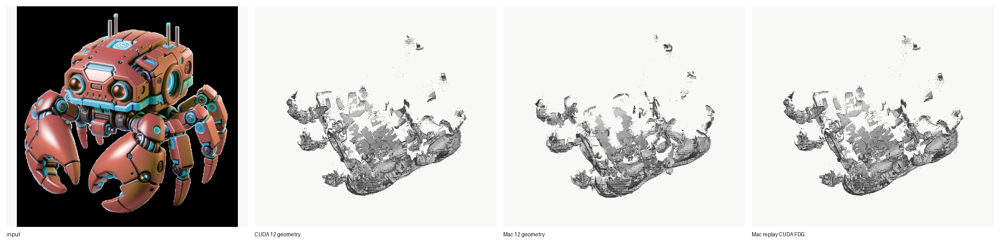
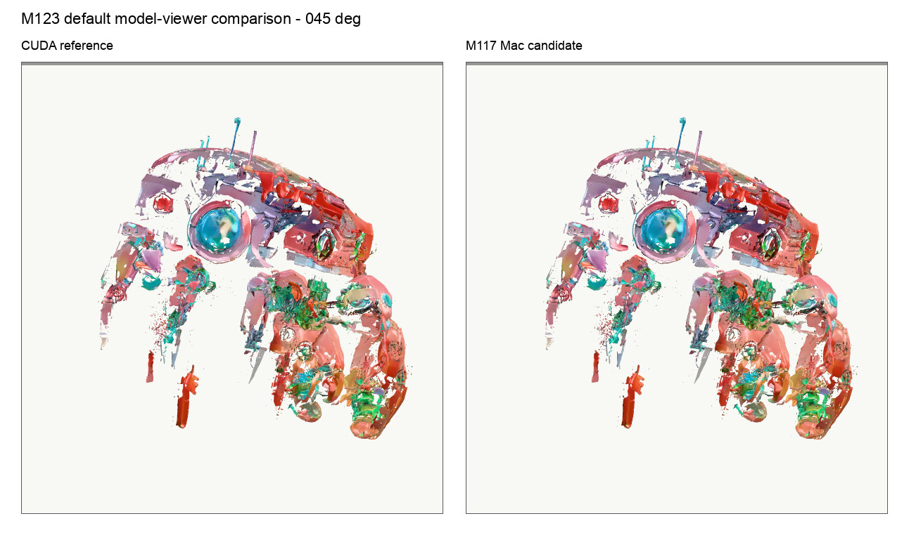

# Case Study: Porting Pixal3D to Apple Silicon

## One-Sentence Claim

This project ports Pixal3D's CUDA-oriented image-to-3D inference/export path to
run locally on Apple Silicon, validates geometry plus real-viewer
texture/material parity against a CUDA/H100 reference for one frozen target,
and documents the agentic verification loop that made the result auditable.

## Original Idea

The original idea was not "make a nice Mac app" and not "rewrite Pixal3D from scratch." It was to demonstrate a rigorous porting workflow for a modern CUDA-first 3D generation system:

1. Build the verification harness before changing the model path.
2. Port one subsystem at a time.
3. Record artifacts for every milestone, including failures.
4. Use CUDA only at the end as an audit/reference, not as a crutch.
5. Publish the work as a case study in engineering judgment: scope control, evidence quality, debugging strategy, and honest claims.

That framing is still the strongest version of the project. The agentic loop that
drove it is documented separately in [`../HARNESS.md`](../HARNESS.md).

## Why This Was Interesting

Pixal3D inherits a TRELLIS.2-style stack with CUDA-oriented components for attention, sparse convolution, mesh extraction, texture baking, and postprocessing. Apple Silicon has a very different execution stack: PyTorch MPS, Metal, unified memory, no CUDA extensions, and different operator support/performance behavior.

The technical question was:

> Can the Pixal3D path be made to run locally on an M4 MacBook Pro, and can that result be verified against official CUDA output well enough to support a portfolio claim?

The answer is yes for the frozen target. Geometry parity evidence was established
first; later boundary captures cleared decoded texture-content under controlled
CUDA/Mac comparison, an integrated native candidate was accepted, and a
final-candidate verifier pass plus human visual acceptance closed the loop. The
claim remains frozen-target scoped.

## Scope

In scope:

- Apple Silicon local inference path.
- Geometry generation and GLB export.
- Device hygiene and CUDA-call removal for the selected inference path.
- SDPA attention fallback.
- MPS-compatible projection sampling.
- Pure-PyTorch sparse convolution fallback.
- Python/PyTorch mesh extraction fallback.
- CUDA reference audit on RunPod H100.
- Documentation and artifact trail suitable for a portfolio study.
- Agentic steering loop: hypothesis register, experiment registry, decision
  log, advisor checkpoints, research-round manifests, and claim governance.

Out of scope:

- Training.
- Broad distribution.
- Consumer packaging.
- Arbitrary Pixal3D release compatibility.
- Bitwise CUDA equivalence.
- General viewer-level texture/style parity across arbitrary inputs, seeds,
  modes, releases, or machines.

## Working Layout

The development tree kept upstream checkouts clean and isolated all Mac-specific
adaptations, so a CUDA reference could be produced from the same tree:

```text
upstream/Pixal3D        clean upstream checkout
upstream/trellis-mac    clean Apple Silicon reference checkout
work/Pixal3D            editable Mac adaptation
scripts/                manifest runner, validators, comparators, CUDA handoff
tests/                  environment, device, math, sparse-conv, mesh, smoke tests
docs/                   plan, status, compatibility, limitations, steering docs, registries
artifacts/runs/         manifests, logs, GLBs, renders, tensor summaries, comparison reports
```

This repository publishes that work as a **patch** against a pinned upstream
commit, plus the validation harness, the case-study docs, and a sanitized
evidence subset — not a vendored copy of the model.

## Main Porting Work

| Area | CUDA/Linux assumption | Mac strategy | Evidence |
|---|---|---|---|
| Device movement | `.cuda()`, `device="cuda"`, `torch.cuda.*` | device helpers and selected-path cleanup | import/device tests |
| Attention | `flash_attn`/CUDA backends | PyTorch SDPA | SDPA tests and E2E runs |
| Projection sampling | `grid_sample(..., padding_mode="border")` | MPS-compatible clamped-grid shim | projection and image-conditioning tests |
| Sparse convolution | `flex_gemm` | pure-PyTorch `conv_none` fallback with streaming/chunking | sparse conv tests, E2E geometry |
| Mesh extraction | `o_voxel` C/CUDA path | Python/PyTorch flexible dual-grid fallback | synthetic mesh tests, CUDA FDG replay |
| Texture export | CUDA/native postprocess | sparse-trilinear/xatlas exporter + native Metal narrow-band remesh | GLB validation, texture comparator, parity gates |
| Verification | ad hoc run success | manifests, stage artifacts, GLB validation, CUDA comparison, adversarial gates | full milestone artifact trail |
| Research steering | transient chat context | first-tier steering docs, research rounds, advisor checkpoints, hypothesis/experiment registries | steering docs and round artifacts |

## Verification Ladder

The project used a layered validation strategy:

1. Environment and static CUDA scan.
2. TRELLIS-Mac baseline.
3. Pixal3D import and device hygiene tests.
4. CPU/MPS math tests for attention and projection.
5. Sparse convolution unit tests.
6. Synthetic mesh extraction tests.
7. Real Pixal3D image-conditioning and pipeline loading.
8. First local geometry and texture exports.
9. MoGe auto-camera proof.
10. CUDA/H100 reference audit.
11. Post-CUDA remediation and 12-step Mac-vs-CUDA geometry comparison.
12. Texture/content CUDA boundary capture and same-shell bake controls.
13. Native remesh/sampler fixes with adversarial metric gates.
14. Final-candidate summary and human visual review only after computational
    gates passed.

This mattered because "a GLB exists" is not enough evidence for a port. The strongest evidence comes from boundary tests and same-target CUDA comparison.

## CUDA Reference Audit

The CUDA audit was run on RunPod H100 using the official-style CUDA stack. Critical CUDA imports passed: `natten`, `flash_attn_interface`, `flex_gemm`, and `o_voxel`.

| Run | Result | Vertices | Faces | Materials | Textures |
|---|---:|---:|---:|---:|---:|
| CUDA robot 4-step geometry | PASS | 257,544 | 419,244 | 0 | 0 |
| CUDA robot 12-step geometry | PASS | 1,451,711 | 2,585,722 | 0 | 0 |
| CUDA robot 12-step textured | PASS | 899,351 | 969,613 | 1 | 1 |
| CUDA sample auto-camera | PASS | 167,215 | 228,494 | 0 | 0 |

The key role of CUDA was not to prove bitwise equality. It provided a concrete target for what the official path produces under the frozen input/config.

## Geometry Result

The final geometry result compares the frozen robot/manual-FOV target at 12 steps. The strongest agreement is at the coarse sparse-structure stage, not the final bounding box:

| Stage metric | Result |
|---|---:|
| Stage-1 sparse coordinate Jaccard | 0.9882 |
| Stage-1 shared coordinates | 3,686 |
| Stage-1 CUDA-only / Mac-only coordinates | 24 / 20 |
| Stage-3 HR SLat coordinate Jaccard | 0.6467 |
| Stage-3 HR SLat feature mean / median cosine | 0.5161 / 0.5891 |

The coarse geometry layout is nearly identical, while high-resolution latent features diverge meaningfully. The final mesh comparison is still structurally close:

| Metric | CUDA 12-step | Mac 12-step |
|---|---:|---:|
| Vertices | 1,451,711 | 1,307,672 |
| Faces | 2,585,722 | 2,332,768 |
| Vertex delta | | 9.92% |
| Face delta | | 9.78% |
| Bbox extent deltas | | 0.30%, 1.02%, 0.33% |



Two control replays localize where the Mac path is exact versus divergent: meshing CUDA's own 12-step FDG tensors through the Mac Python path reproduces vertex/face counts exactly, and decoding CUDA's 4-step HR shape latents through the Mac decoder lands within sub-0.1% mesh deltas. So the Mac mesh/export path is faithful *given* CUDA neural tensors; the structural divergence is upstream in the neural decode, and the HR latent-feature cosine of ~0.52 is the honest limit — this is not full latent parity.

## Texture Result

Texture/material parity was the long, hard final stretch, and it started from a
negative result: the official dense-bake route failed locally, and a first
KDTree/xatlas exporter changed material statistics (roughness defaulting to
`1.0` outside sampled texels, where official Pixal3D zero-initializes and
inpaints only the UV-invalid mask). Dozens of candidates were generated,
measured against a strict gate, and rejected; a 6,912-variant
coordinate/channel/color/sampler sweep found no cheap convention rescue.

A fresh CUDA H100 boundary capture then showed the neural texture path is
numerically very close to CUDA at the captured boundaries:

| Boundary metric | Result |
|---|---:|
| Texture SLat coordinate Jaccard / mean cosine | 1.0 / 0.999971 |
| Decoded texture-voxel Jaccard / feature MAE | 0.99653 / 0.000931 |
| Same-shell decoded-PBR base-color MAE | ~0.0009 |

That localized the remaining gap to native shell/remesh, sampler, and topology
handling rather than the neural field. The accepted result is an integrated
native candidate evaluated against the CUDA reference: it clears all 13
final-candidate gates under a 4-million-sample parity gate stable across seeds
42/43/44, with viewer-accurate stored-vertex normal semantics, followed by
human visual acceptance of the paired default/close-up/specular render sheets.



This parity is accepted **only** for that exact frozen candidate/reference pair.
It is not general CUDA texture parity, and earlier candidates explicitly failed
visual parity.

## Key Debugging Pivot

An earlier working theory treated FDG graph fragmentation as evidence of semantic failure. The CUDA audit corrected that interpretation. Official CUDA was also highly multi-component under the same threshold-0 metric:

| Run | Coords | Active components | Largest-component node fraction |
|---|---:|---:|---:|
| Mac 4-step robot | 187,131 | 1,524 | 19.4% |
| CUDA 4-step robot | 257,544 | 2,571 | 7.8% |
| CUDA 12-step robot | 1,451,711 | 5,536 | 15.7% |

The lesson: **a diagnostic metric is not a fidelity gate until it has been calibrated against a reference.** Building a same-tree CUDA reference specifically to audit the Mac port — and then trusting the data over the initial theory — is the part of this work that is hardest to fake.

The loop also found and fixed real bugs along the way: a silent node-dropping
traversal bug in a Metal BVH kernel (lifting shell-area parity vs CUDA from
~0.33 to ~0.99 after switching to stackless traversal), and a texture-color
sampling bug in the MPS `grid_sample` fallback (collapsing base-color error from
~0.169 to ~0.012). Both were only findable against the real CUDA path.

## What Is Not Claimed

Do not claim:

- General CUDA-equivalent texture quality in a real viewer across arbitrary
  inputs or configurations.
- That every future Pixal3D input/mode/release will pass the same gate.
- CUDA-equivalent speed.
- General Pixal3D Mac distribution.
- Arbitrary-input parity.
- Bitwise equality.
- A polished consumer app.

## Future Work

The next step would be full texture/style equivalence: capture the full chain of
CUDA texture intermediates (conditioning, texture noise, texture SLat, decoder
guides, raw and processed decoded voxels, final atlas, final GLB) in one CUDA
session, and compare fixed-camera real-viewer renders only after the
intermediate boundaries explain where CUDA and Mac first diverge. That is a
reasonable follow-up, not a claim of the current work.
